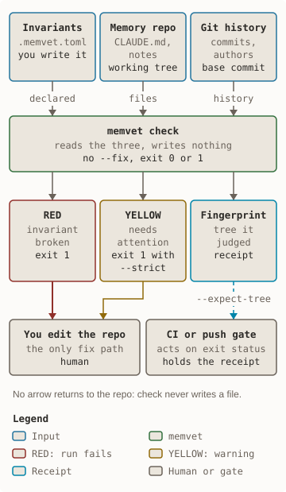
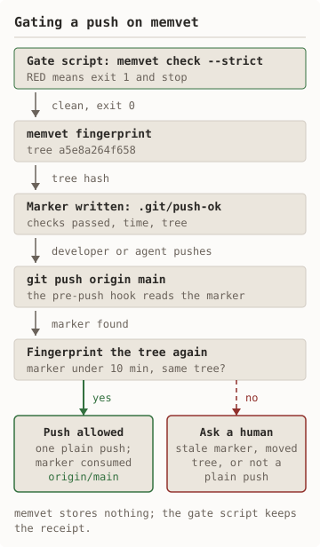
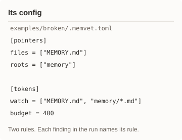
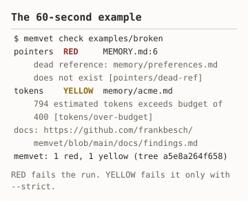

# memvet

[](https://github.com/frankbesch/memvet/actions/workflows/ci.yml)
[](LICENSE)

Integrity checks for file-based AI agent state: memory, instructions,
decisions, and contracts.

Think `go vet` or `fsck`, not ESLint. memvet verifies properties you declare
must stay true across a repo of markdown that an agent runtime reads as
memory. It does not judge prose, and it is not a memory store.

`check` is **read-only**. It never edits, creates, moves, or deletes a file,
and there is no `--fix`. The one write in the whole tool is `memvet init`,
which creates a starter config once and refuses to overwrite it.

## The failure mode

Runtimes like Claude Code and Codex load `CLAUDE.md`, `MEMORY.md`, and a
folder of notes into context on every run. Those files drift silently:

- `MEMORY.md` still points at a note that was renamed last week.
- An append-only decision log was quietly rewritten.
- `CLAUDE.md` and `AGENTS.md` are supposed to be identical and no longer are.

Nothing fails. The agent just works from something that is no longer true.
memvet turns each of those into a RED finding with a file, a line, and a code.

<picture><source media="(prefers-color-scheme: dark)" srcset="docs/diagrams/positioning-dark.svg"/></picture> <picture><source media="(prefers-color-scheme: dark)" srcset="docs/diagrams/push-gate-dark.svg"/></picture>

<details><summary>Text version of the diagrams</summary>

Three inputs go into `memvet check`: the invariants declared in `.memvet.toml`,
the memory repo as it is in the working tree, and git history for authorship
and the base commit. `check` reads them and writes nothing. Out come a RED
finding (exit 1), a YELLOW finding (warns; fails only under `--strict`), and a
tree fingerprint, the receipt of the tree it judged. RED and YELLOW go to the
human, who edits the repo, the only fix path. The fingerprint goes to CI or a
push gate, which can hold a later run to it with `--expect-tree`. No arrow
returns to the repo.

A gate script runs `memvet check --strict`; RED means exit 1 and stop. On a
clean run it runs `memvet fingerprint` and writes a marker, `.git/push-ok`,
naming the checks passed, the time, and the tree. On `git push origin main`
the pre-push hook reads the marker and fingerprints the tree again. A marker
under 10 minutes old with a matching tree allows one plain push and is
consumed. A stale marker, a moved tree, or a push that is not plain asks a
human.

</details>

## 60-second example

[examples/broken](examples/broken) is a three-file memory repo with two
defects. Its config, and what `memvet check` prints for it:

<picture><source media="(prefers-color-scheme: dark)" srcset="docs/diagrams/example-config-dark.svg"/></picture> <picture><source media="(prefers-color-scheme: dark)" srcset="docs/diagrams/example-output-dark.svg"/></picture>

<details><summary>The config and the output as text</summary>

```toml
[pointers]
files = ["MEMORY.md"]
roots = ["memory"]

[tokens]
watch = ["MEMORY.md", "memory/*.md"]
budget = 400
```

<!-- examples/broken output: kept identical to the real run by TestReadmeOutputMatchesExample -->
```text
pointers  RED     MEMORY.md:6     dead reference: memory/preferences.md does not exist [pointers/dead-ref]
tokens    YELLOW  memory/acme.md  794 estimated tokens exceeds budget of 400 [tokens/over-budget]
docs: https://github.com/frankbesch/memvet/blob/main/docs/findings.md
memvet: 1 red, 1 yellow (tree a5e8a264f658)
```

</details>

RED means a declared invariant is broken and the run exits 1. YELLOW needs
attention and fails the run only under `--strict`. Every code links to a
plain-English entry in [docs/findings.md](docs/findings.md).

## Install

```bash
brew install frankbesch/tap/memvet
```

```bash
go install \
  github.com/frankbesch/memvet@latest
```

Or try it once, without installing, on the repo you are in:

```bash
go run \
  github.com/frankbesch/memvet@latest \
  check .
```

With no `.memvet.toml` yet, `check` runs what it can infer from the tree
and says so in its first line. Binaries for macOS and Linux are on the
[releases page](https://github.com/frankbesch/memvet/releases), with
`checksums.txt` to verify them; `memvet --version` tells you what you got.

## Quick start

From the root of the repo your agent uses as memory:

```bash
memvet init
memvet check
```

`init` inspects the repo, writes a `.memvet.toml` that enables only the
rules it found evidence for, and reports what it enabled, what it only
suggests, and what it refused to guess; `--dry-run` shows the config without
writing it. Review it, then add rules from the table below as your repo
accumulates invariants worth declaring. Ready-made configs for common
layouts are in [docs/recipes.md](docs/recipes.md).

## What can it protect?

| I need to make sure that… | Rule |
|---|---|
| references between memory files still resolve | [`pointers`](docs/rules.md#pointers--references-that-must-resolve--red) |
| the decision log was only ever appended to | [`append_only`](docs/rules.md#append_only--logs-that-may-only-grow--red) |
| copies of the agent instructions stay identical | [`mirrors`](docs/rules.md#mirrors--files-that-must-stay-identical--red) |
| an agent-owned block keeps its start and end markers | [`blocks`](docs/rules.md#blocks--ownership-blocks-that-must-stay-well-formed--red) |
| a human-written brief was never written by an agent | [`human_brief`](docs/rules.md#human_brief--files-agents-must-never-write--red) |
| decision ids are unique, cited, and in order | [`ids`](docs/rules.md#ids--ids-that-must-be-unique--red) |
| memory files stay within a token budget | [`tokens`](docs/rules.md#tokens--notes-that-got-too-expensive--yellow--red) |
| "last verified" stamps keep up with edits | [`stamps`](docs/rules.md#stamps--last-verified-dates-that-must-keep-up--yellow) |
| scratch files do not creep into the repo | [`junk`](docs/rules.md#junk--files-that-should-not-be-there--yellow) |
| credential-shaped strings never land in memory | [`secrets`](docs/rules.md#secrets--credentials-that-must-not-be-there--red) |

A section's presence in `.memvet.toml` is what enables its rule. Full key
reference and the five ideas behind the ten rules:
[docs/rules.md](docs/rules.md).

## In CI

The shortest form is the action, which fetches the released binary and
runs `check --format github`:

```yaml
- uses: actions/checkout@v4
  with:
    fetch-depth: 0
- uses: frankbesch/memvet@v0.12.0
  with:
    strict: true
    base:
      ${{github.event.pull_request.base.sha}}
```

`--format github` renders each finding as an inline annotation on the diff.
`--base` matters for `append_only`: a fresh checkout equals its own HEAD, so
without a base the log has nothing to be compared against. `fetch-depth: 0`
makes that base reachable. A complete pull-request workflow using
`go install` instead is in
[.github/examples/memvet.yml](.github/examples/memvet.yml).

Every `check` summary ends with a fingerprint of the exact tree it judged,
and `--expect-tree` holds a later run to it: a tree that changed in between
is one RED finding. memvet stores nothing; the caller keeps the receipt. A
push gate built on that is drawn under [The failure mode](#the-failure-mode).


## Documentation

- [Configuration](docs/configuration.md): the `.memvet.toml` format and what it rejects.
- [Rules](docs/rules.md): every rule, its keys, what it proves and what it cannot.
- [Recipes](docs/recipes.md): copy-and-paste configs for common layouts, each a runnable example.
- [Command line](docs/cli.md): flags, exit codes, JSON and GitHub output. [Development](docs/development.md): tests, fixtures, releases, roadmap.
- [Finding codes](docs/findings.md): what each code means and what to do. [Tree receipts](docs/tree-receipts.md): fingerprints and `--expect-tree`.
- [SPEC.md](SPEC.md): the versioned build log, for design provenance.
- [CONTRIBUTING.md](CONTRIBUTING.md): behavior changes start as a SPEC.md addendum with gates. Bug reports and proposed invariants are welcome as issues.

## What memvet does not do

- Judge whether a memory is correct, useful, or well written.
- Decide what an agent should remember.
- Prove agent authorship when git metadata does not identify the agent.
- Replace a full secret scanner; `[secrets]` is a last-mile tripwire on the working tree.
- Repair anything. `check` never writes, and `init` only creates a config that did not exist.
- Watch mode, HTML output, or a hosted service.

## License

MIT. See [LICENSE](LICENSE).
